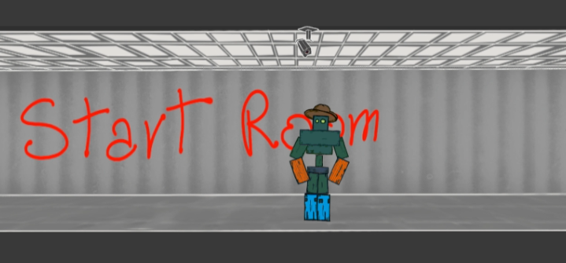

# Cowboya

Cowboya is a comedic 2D rogue‑lite where you pilot a robot through a sprawling
factory. Each run lets you gather gears and special resources to improve your
machine back at camp. Attacks can be rearranged into custom combos, energy and
health are upgraded over time, and a morality system tweaks how enemies react to
you.

## Screenshots




## Running Edit Mode Tests

This project uses Unity's built in Test Framework. Edit mode tests live under
`Assets/Tests/EditMode` and are compiled into their own assembly.

### Using the Unity Editor

1. Open the project in the Unity Editor.
2. Open **Window > General > Test Runner**.
3. Select the **Edit Mode** tab and click **Run All** to execute the tests.

### Using the Command Line

If you have the Unity Editor installed and available as `unity`, tests can be
run non‑interactively:

```bash
unity -runTests -testPlatform EditMode -projectPath "$(pwd)" -quit
```

The command will return a non‑zero exit code if any tests fail.

### WebGL Persistent Data

Saved files in WebGL builds reside in the browser's IndexedDB storage. The
`PUBLISH_WEB/index.html` template sets `config.autoSyncPersistentDataPath = true`
so writes to `Application.persistentDataPath` are automatically synchronized.
If browser file operations fail, consider using `PlayerPrefs` or a custom
JavaScript plugin.
