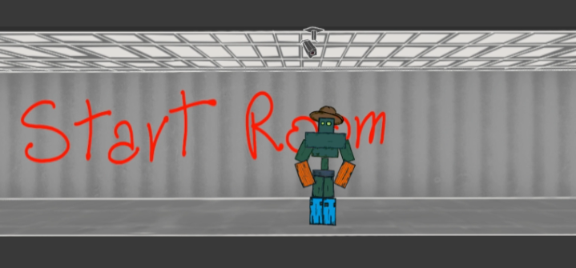

# Cowboya

Cowboya is a comedic 2D rogue-lite where you pilot a robot through a sprawling
factory. Each run lets you gather gears and special resources to improve your
machine back at camp. Attacks can be rearranged into custom combos, energy and
health are upgraded over time, and a morality system tweaks how enemies react
to you.

## Screenshots




## Running Edit Mode Tests

This project uses Unity's built-in Test Framework. Edit Mode tests currently
live under `Assets/Editor/UnitTests`.

### Using the Unity Editor

1. Open the project in the Unity Editor.
2. Open **Window > General > Test Runner**.
3. Select the **Edit Mode** tab and click **Run All**.

### Using the Command Line

On Windows PowerShell:

```powershell
powershell -ExecutionPolicy Bypass -File Tools/run-editmode-tests.ps1
```

On Linux or macOS:

```bash
./Tools/run-editmode-tests.sh
```

Both scripts read the required editor version from
`ProjectSettings/ProjectVersion.txt`, write results and logs to `Logs/CI/`, and
return a non-zero exit code when tests fail. Set `UNITY_PATH` on Unix or pass
`-UnityPath` on Windows when Unity Hub is installed outside its default
location. Use a separate clone when the project is already open in Unity.

## Continuous Integration

`.github/workflows/unity-ci.yml` validates Unity metadata, runs the complete
Edit Mode suite, and creates a WebGL artifact on pushes and pull requests. It
pins Unity `6000.3.22f1`, uses the committed `Packages/packages-lock.json`, and
records the commit, editor version, and package-lock checksum in
`BUILD-PROVENANCE.txt` beside every build.

Configure the `UNITY_LICENSE` GitHub secret before enabling the workflow.
`UNITY_EMAIL` and `UNITY_PASSWORD` are also supported when required by the
license type.

### WebGL Persistent Data

Saved files in WebGL builds reside in the browser's IndexedDB storage. The
published template must explicitly enable synchronization before persistence
across browser reloads can be considered supported.
